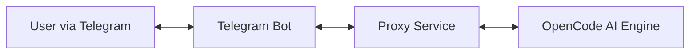

# OpenKlavdii: OpenCode AI Telegram Bot 🤖


**OpenKlavdii** is a powerful interface that bridges the gap between Telegram and the [OpenCode AI](https://opencode.ai) coding agent. It allows developers to manage coding sessions, generate code, debug errors, and refactor projects directly from their favorite messenger.

> **Note**: This project acts as a middleware/proxy. It requires a running instance of OpenCode AI (local or remote) to function fully.

## 🏗 Architecture

The bot serves as a frontend for the OpenCode ecosystem:



## ✨ Key Features

- **🔐 Session Management**: Isolate contexts with unique session IDs (`/new_session`, `/switch_session`).
- **💻 Code Generation**: Describe tasks in natural language and get code in Python, JS, Go, Rust, etc.
- **🐞 Smart Debugging**: Send tracebacks or code snippets to get instant fix suggestions.
- **♻️ Refactoring**: Optimize code for performance, readability, or complexity.
- **📄 Documentation**: Auto-generate docstrings and READMEs.

## 🚀 Getting Started

### Prerequisites

- Python 3.9+
- Redis (optional, for persistent sessions)
- An OpenCode AI instance (or use the built-in mock for testing)

### Installation

1.  **Clone the repository**
    ```bash
    git clone https://github.com/yourusername/opencode-telegram-bot.git
    cd opencode-telegram-bot
    ```

2.  **Create a virtual environment**
    ```bash
    python -m venv .venv
    source .venv/bin/activate  # On Windows: .venv\Scripts\activate
    ```

3.  **Install dependencies**
    ```bash
    pip install -r requirements.txt
    ```

4.  **Configuration**
    Create a `.env` file in the root directory:
    ```env
    BOT_TOKEN=your_telegram_bot_token_here
    REDIS_URL=redis://localhost:6379/0
    OPENCODE_API_URL=http://localhost:8000
    ```

### Running the Bot

```bash
python bot/main.py
```

## 📚 Usage Guide

| Command | Description |
|---------|-------------|
| `/start` | Initialize the bot and welcome message |
| `/new_session` | Create a fresh coding context |
| `/list_sessions` | View all your active sessions |
| `/generate` | Start a code generation dialogue |
| `/debug` | Analyze code or error logs |
| `/refactor` | Request code optimization |

## 🧪 Testing

Run the unit tests to verify core logic:

```bash
python -m unittest discover tests
```

## 🤝 Contributing

Contributions are welcome! Please feel free to submit a Pull Request.

1.  Fork the project
2.  Create your feature branch (`git checkout -b feature/AmazingFeature`)
3.  Commit your changes (`git commit -m 'Add some AmazingFeature'`)
4.  Push to the branch (`git push origin feature/AmazingFeature`)
5.  Open a Pull Request

## 📄 License

This project is licensed under the MIT License - see the [LICENSE](LICENSE) file for details.

## 👤 Author

**Bimaev Oleg**

---
Built with ❤️ for the OpenCode Community.
